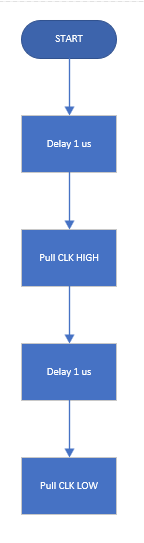
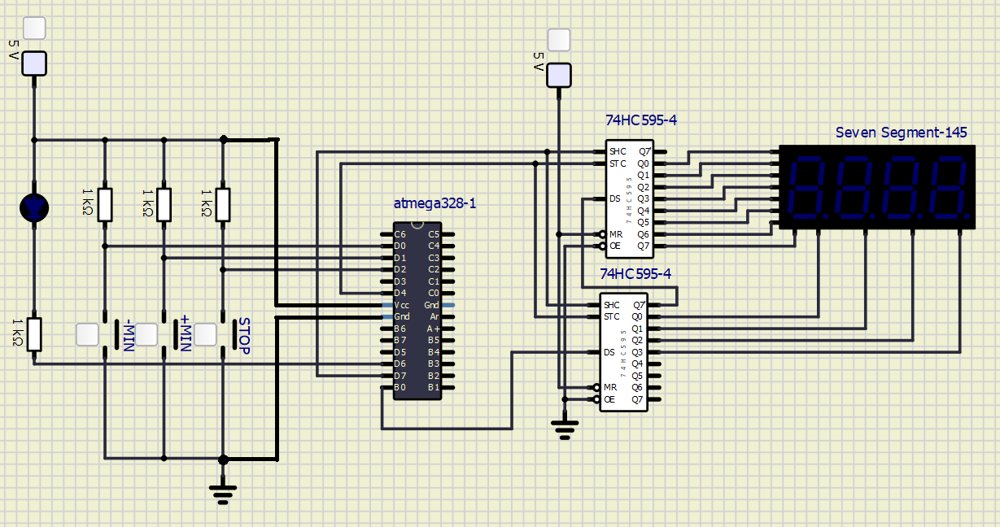

# Lab 5: Jiří Tomešek

Link to your `Digital-electronics-2` GitHub repository:

  https://github.com/xtomes07/Digital-electronics-2


### 7-segment library

1. In your words, describe the difference between Common Cathode and Common Anode 7-segment display.
   * CC SSD - se společnou katodou jsou aktivní v jedničce, společná katoda je uzemněna
   * CA SSD - se společnou anodou jsou aktvní v nule, společná anoda je přivedena k napájecímu napětí

2. Code listing with syntax highlighting of two interrupt service routines (`TIMER0_OVF_vect`, `TIMER0_OVF_vect`) from counter application with at least two digits, ie. values from 00 to 59:

```c
/**********************************************************************
 * Function: Timer/Counter1 overflow interrupt
 * Purpose:  Increment counter value from 00 to 59.
 **********************************************************************/
ISR(TIMER1_OVF_vect)
{
    // WRITE YOUR CODE HERE
   val = val + 1;
   if (val == 59) 
      {
         val = 0;
      } 
}
```

```c
/**********************************************************************
 * Function: Timer/Counter0 overflow interrupt
 * Purpose:  Display tens and units of a counter at SSD.
 **********************************************************************/
ISR(TIMER0_OVF_vect)
{
    static uint8_t pos = 0;  // This line will only run the first time
    static int pow10[5] = { 1, 10, 100, 1000, 10000 };
    
    // calculate digit from number and pos
    uint16_t loc_val = (val % pow10[pos+1]) / (pow10[pos]);
    
    // Update segment
    SEG_update_shift_regs(loc_val, pos);
    
    // Increment to go to next segment
    pos++;
    if (pos == 4) pos = 0;
}
```

3. Flowchart figure for function `SEG_clk_2us()` which generates one clock period on `SEG_CLK` pin with a duration of 2&nbsp;us. The image can be drawn on a computer or by hand. Use clear descriptions of the individual steps of the algorithms.

   


### Kitchen alarm

Consider a kitchen alarm with a 7-segment display, one LED and three push buttons: start, +1 minute, -1 minute. Use the +1/-1 minute buttons to increment/decrement the timer value. After pressing the Start button, the countdown starts. The countdown value is shown on the display in the form of mm.ss (minutes.seconds). At the end of the countdown, the LED will start blinking.

1. Scheme of kitchen alarm; do not forget the supply voltage. The image can be drawn on a computer or by hand. Always name all components and their values.

   
